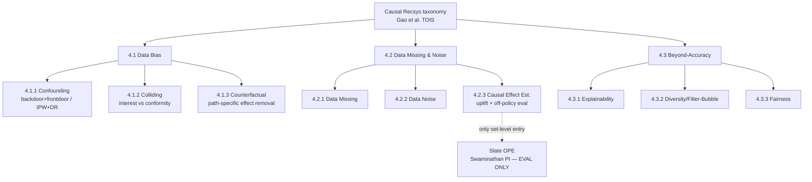

# Causal inference for ranking & bundle/set construction — landscape + ranked research lines

> **Run:** `causal-recsys-bundle-construction`, 2026-06-28. Deep multi-agent sweep (7 parallel
> researchers + cross-map; cite + adversarial-verify passes). Source of raw digests:
> `research/outputs/.plans/` ledger + the gather transcript.
> **Verification status of citations:** see [.provenance.md](causal-recsys-bundle-construction.provenance.md).
> Evidence labels: **FACT** = stated by a primary source we read; **GAP** = absence verified by
> exhaustive scan + spot-checks; **HYPOTHESIS** = our inference, to test empirically.

## TL;DR (the headline verdict)

1. **Both gap hypotheses are CONFIRMED**, triangulated across the field's own survey, both curated
   awesome-lists (~70 deduped papers), and targeted web search:
   - **GAP A — set/bundle-level causal *estimand for construction*:** white space. The field has
     set-level causal *evaluation* (slate off-policy estimators) and pointwise *confounder theory*
     (popularity/exposure backdoor), but has **never fused them into a set-construction decoder**.
   - **GAP B — causal *generative/diffusion* decoder:** essentially empty. Generative slate/bundle
     decoders (DiffRec, DreamRec, TIGER, GeMS, DDBC, DMSG) are non-causal; the few causal×generative
     works keep the causal term in the loss/representation/augmentation, not on the decode trajectory.
2. **The building blocks all exist and are non-inert** — PDA (inference-time popularity exponent),
   MACR (decode-time TIE subtraction), D3 (decode-score edit in generative recsys), UpliftRec
   (set-CATE on the decode path via DP), OPCB (set-propensity policy gradient). Only their
   **combination** (set-level estimand + co-occurrence/exposure confounding + generative/decode-path
   placement + intervention verification) is unoccupied.
3. **The bar is the hard part, not the gap.** Plain co-occurrence already beats DDBC full-catalog;
   the new method must beat **co-occ / retrieve-then-rerank full-catalog** *and* show a verified
   causal gain. Two recent papers partially occupy our flanks and must be differentiated against:
   **Cadence** (item-item co-purchase deconfounding vs popularity — but for *diversity*, not
   complementarity/construction) and **A2G-DiffRec** (observable-gated decode-path guidance on a
   set-level diffusion recommender — but for *item-side fairness/long-tail*, not a causal estimand).
4. **Recommended shortlist (2 designs to carry to brainstorming):**
   **(S1) Set-PDA** — a load-bearing, observable-gated popularity/exposure deconfounding term on the
   per-pick decode score of a generative bundle decoder; and **(S2) Completion-uplift reranker** —
   select by the orthogonalized causal *lift* of adding item *j* to the partial bundle, over the
   winning retrieve-then-rerank backbone. S1 maximizes novelty (fills both gaps); S2 maximizes
   realistic bar-clearing (rides the only backbone that already beats co-occ). A **within-set
   interaction (synergy) estimand** is the cleanest differentiator vs Cadence and should be the
   theoretical spine of whichever design is chosen.

---

## 1. The bar (recap — the filter every line is scored against)

From [docs/findings/00-SUMMARY.md](../../../docs/findings/00-SUMMARY.md) and
[docs/learnings/LEARNINGS-from-bundle-ranking-project.md](../../../docs/learnings/LEARNINGS-from-bundle-ranking-project.md):

- **FACT — full-catalog or it doesn't count.** Shortlist/sampled-neg eval over-claims (proven twice:
  content-reranker reversal; DDBC shortlist→full-catalog collapse to ~0.06 hit@1).
- **FACT — co-occ already beats DDBC full-catalog.** So "beat DDBC" is cheap; the real bar is
  **beat co-occ AND retrieve-then-rerank** full-catalog. Retrieve-rerank (PPMI-SVD CF over co-occ
  candidates) wins on dense MealRec but **does not transfer** to the 254k-sparse Spotify catalog.
- **FACT — the inertness trap (3×).** Causal/auxiliary terms went inert every time they were
  *optional* at decode. The predecessor's user-theme `do(seed)` moved the output ~2% vs a ~99%
  sampler-noise null; an oracle theme added ~0 at the decode argmax.
- **FACT — "load-bearing ≠ better."** Forcing the causal term globally load-bearing displaced clean
  accuracy 3×. The working fix (gate-g) is **conditional/observable-gated** OR **decode-path /
  estimand-level** placement — never globally forced.
- **Mandatory diagnostic** on any causal term: ablation Δ, τ@0 / set-correlation under ablation,
  gradient-flow magnitude. "In the architecture" ≠ "exercised at inference."

These convert directly into the scoring rubric: **novelty, fit-to-data** (use co-occ/exposure/
popularity signal we KNOW exists, not user-theme), **verifiability** (passes the inertness
diagnostic), **feasibility** (vs DDBC + co-occ/RR on our 3 datasets), **bar-clearing** (plausibly
beats co-occ/RR full-catalog).

---

## 2. The field, as the survey draws it (Gao et al. 2208.12397, TOIS)

**FACT.** The canonical taxonomy is pointwise (treatment/outcome per user–item pair):

- **FACT.** "bundle", "basket", "complementary", "co-occurrence" appear **zero** times in the survey.
  Set-level causality appears **only** in §4.2.3 as off-policy *evaluation* of a slate policy
  (Swaminathan pseudoinverse; cascade/PBM-DR). "generative" = GAIL imitation; "diffusion" = GNN
  influence diffusion. No causal decoder anywhere.
- **FACT.** The survey's most-developed confounders — item **popularity** (PDA, MACR), **exposure**
  (IPS/DR family), item-**category/exposure imbalance** (DecRS) — are exactly the confounders our
  data flagged. All treated pointwise; none at the set/co-occurrence level.
- **Four Future Directions:** 5.1 causal **discovery** (learn the causal graph, not hand-craft it),
  5.2 causality-aware **stable/robust/OOD** (gate on observable shift), 5.3 causality-aware **GNN**
  ("open and uncharted frontier"), 5.4 causal **simulator/world-model** (long-term utility, the
  intervention-verification harness). None mentions set-level estimands or generative decoders →
  the cleanest possible evidence that our intersection is white space *in the field's own self-assessment*.

---

## 3. The decisive axis: WHERE the causal term lives (placement)

The single most important filter for this project is **placement**, because it determines
inertness. From the sweep:

| Placement | Behavior at decode | Examples | Verdict for us |
|---|---|---|---|
| **loss-only** (propensity reweighting, DR objective, alignment regularizer) | scorer unchanged at inference → **structurally inert** | IPS/Schnabel, DR-JL/MRDR/CDR, Saito-MNAR, CausE, ExpoMF, counterfactual-LTR, control-function | **AVOID** — the predecessor's exact failure mode |
| **data-augmentation** | "counterfactual" consumed as training data → bypassable | CauseRec, CASR, CLBR, counterfactual-session-aug | **AVOID** (densification only) |
| **representation** | causal correction baked into embeddings; argmax can route around it | DecRS, CausalDiffRec, IV4Rec, COR | **CAUTION** — must ablate; can wash out (user-theme was inert despite "being in the architecture") |
| **inference / decode-path** | causal term in the scoring/decode argmax → **exercised, ablatable** | **PDA** (popularity^γ at serving), **MACR** (TIE subtraction), **D3** (decode-score edit), **UpliftRec** (DP over treatments at decode), **OPCB** (set-policy gradient), **A2G-DiffRec** (autoguidance) | **TARGET** — the only non-inert placements |

**FACT.** Of ~70 curated causal-recsys papers, the decode-path set is tiny (PDA, MACR, CR, partly
DecRS/COR) and **all pointwise**. The set-level decode-path cell is empty except for very recent,
non-construction work (UpliftRec category-ratios; A2G-DiffRec fairness; OPCB flat bandit).

**DDBC alignment (FACT, from [docs/baselines/ddbc-repro-spec.md](../../../docs/baselines/ddbc-repro-spec.md)):**
DDBC's **clamp/generate split** (observed seed tokens clamped, missing tokens iteratively unmasked) is
the natural structural carrier for a `do(item ∈ set)` intervention at decode. Its `cond_dim=128`
conditioning slot is **information-free today** (carries only a zeroed timestep embedding) — a ready
injection point, *but* injecting there is global FiLM conditioning (the inert pattern); a decode-path
*per-pick logit* correction (§5/§6 below) is the non-inert placement.

---

## 4. Cross-map — each family at the SET/bundle level

For every family: treatment / outcome / confounder / estimand / **non-inert placement** /
verifiability verdict, specialized to bundle construction. (Full per-paper tables in the provenance.)

### 4.1 Debiasing (IPW / DR / exposure / position / popularity / slate-OPE)
- **treatment** = joint exposure of candidate *j* given the partial bundle. **outcome** = held-out
  set-completion correctness. **confounder** = popularity / joint-exposure imbalance inflating raw
  co-occurrence. **estimand** = deconfounded complementarity `P(co-purchase | do(add j), exposure adj)`
  (DR/IPS-corrected; OPCB factored main+residual over the subset).
- **placement** = per-pick decode multiplier (PDA-style) or OPCB set-policy gradient; gated on
  observable popularity-skew. **verifiability** = PASSES by construction if a decode multiplier
  (γ=0 recovers baseline). **RISK** = collapses to a monotone transform of co-occ (no rank change) or
  importance weights clip to ~1 on sparse Spotify → inert. Must beat **PPMI-normalized** co-occ, not
  just raw.

### 4.2 Deconfounding (backdoor / front-door / substitute-confounder / IV / causal embeddings)
- **treatment** = `do(add j | partial set)`. **confounder** = item-group/popularity distribution of
  the partial set (backdoor, DecRS-style) or unobserved seed/exposure confounders (front-door).
  **estimand** = backdoor `P(Y | do(add j), Σ popularity/group dist.)` or front-door with the
  **partial bundle as mediator** (HCR / Causal-Prompting factorization).
- **placement** = backdoor expectation pushed into per-pick scoring; or front-door computed over the
  partial-bundle continuations the decoder already materializes → intrinsically on the decode path.
  **RISK** = backdoor absorbed into a representation washes out (ablate!); front-door inherits the
  **exponential-treatment positivity** problem (Complex-Treatments survey) → high-variance mediator
  sampling can wash the term out. **IV is an off-ramp** (no search-query instrument in our data).

### 4.3 Counterfactual + uplift (treatment = adding/recommending; estimand = CATE, not P(click))
- **treatment** = add item *j* to the partial bundle vs not. **outcome** = completion-lift.
  **confounder** = popularity/exposure, orthogonalized away (Neyman/Robinson, Su et al.).
  **estimand** = set-conditional CATE `lift(j|S) = E[Y|do(add j),S] − E[Y|S]`, estimated
  retrospectively from observed completed sets (positives-only, Goldenberg).
- **placement** = the decode **selection rule** itself (argmax lift, not argmax co-occ likelihood) —
  changes the estimand, so it cannot be bypassed (UpliftRec's DP is the set-level precedent).
  **RISK** = no per-instance counterfactual ground truth; over-subtracting popularity loses to co-occ;
  per-step uplift over 254k items is costly without a shortlist (which reintroduces the neg-sampling artifact).

### 4.4 Generative / diffusion causal decoder
- **treatment** = the decode trajectory (each unmask/denoise step placing an item under
  `do(item ∈ set | partial set)`; DDBC clamp/generate is the do-carrier). **outcome** = the completed
  SET as the causal output. **confounder** = popularity/length amplification in the decoder's own
  logits (D3's amplification bias) + exposure-confounded co-occ baked into the generative likelihood.
- **estimand** = decode-time deconfounded generation score (set-level PDA×D3 per step, or front-door
  over generated partial-bundle mediators). **placement** = inference/decode path ONLY, in the
  denoise step (D3 proves a frozen-model decode-score edit verifiably changes outputs).
  **RISK** = decoder may already implicitly normalize popularity (near-inert); **DDBC decode is weak
  full-catalog** → a causal term can beat DDBC yet still lose to co-occ.

### 4.5 Set/slate/bundle-level combinatorial estimands
- **treatment** = the whole set as a combinatorial/permutation-invariant treatment `T ∈ {0,1}^m`.
  **estimand** = slate interventional value (Swaminathan PI) used as a **construction** objective, or
  bundle-as-treatment effect vs a reference set; **within-set interaction (synergy)** = the named
  open problem (Complex-Treatments survey §8.1.2; NCoRE is the lone structural precedent).
- **RISK** = the PI/SlateQ/PRR strand assumes **additive / single-choice reward** that erases
  within-set synergy by construction; off-policy variance/positivity on 254k-sparse makes the value a
  near-no-op vs co-occ.

---

## 5. Novelty-collision watch (what is already taken — differentiate against these)

| Paper | What it occupies | Threatens which line | Required differentiator |
|---|---|---|---|
| **Cadence** (2512.17733, Dec'25) | item-item co-purchase deconfounding vs popularity + user-attr, **full-catalog ablations** | "deconfound co-occ vs popularity" (Set-PDA, joint-exposure, substitute-confounder) | objective = **complementarity/completion + within-set interaction**, NOT anti-popularity **diversity**; and **construction**, not reranking a list |
| **A2G-DiffRec** (2602.14706, '26) | **observable-gated decode-path autoguidance** on a **set-level diffusion** recommender | "observable-gated decode-path" novelty of S1 | a **formal causal estimand** (not a fairness correction); **item-item complementarity** confounding, not item-side long-tail exposure; do()-verified gain over co-occ |
| **UpliftRec** (2405.08582, SIGIR'24) | **set-CATE on the decode path** via DP | completion-uplift line (S2) | treatment = **per-item add to partial bundle**, not coarse **category exposure ratios**; complementarity, not interest exploration |
| **OPCB** (2408.11202, RecSys'24) | **set propensity + off-policy learning**, factored main+residual | Bundle-OPCB | a **generative/iterative** bundle decoder, not a flat combinatorial bandit; co-occ retriever as the residual baseline |
| **D3** (2406.14900, EMNLP'24) | decode-path score edit in generative recsys (non-inertness gold standard) | the *mechanism* of S1 | ours is a **formal do()/backdoor estimand**, not a length/popularity normalization heuristic |
| **DMSG** (2408.06883, RecSys'25) | diffusion **slate/bundle** decoder (joint set dist.), names playlists/bundles | the generative substrate | add the **causal estimand on the decode path** (DMSG is explicitly non-causal) |
| **Complex-Treatments survey** (2407.14022) + **NCoRE** (2103.11589) | bundle-as-treatment effect **estimation**; within-set interaction named as OPEN | the synergy estimand's theory | instantiate it for **recsys set construction**, full-catalog, decode-path |

**Implication (HYPOTHESIS):** the plain claim "deconfound co-occurrence against popularity" is **no
longer fully novel** (Cadence). The defensible novelty is the **combination**: a **within-set
interaction / completion estimand**, placed on the **generative/decode path** of a **constructor**,
**observable-gated**, and **intervention-verified at full-catalog**. None of the surveyed works
occupy that point.

---

## 6. Ranked research lines

Scores 1–5 (higher better); **total** /25. Adjusted from the cross-map by local-knowledge weighting
(DDBC-decode-weak penalty on generative-backbone lines; Cadence/A2G collision penalty on plain
deconfounding; gate-g bonus on observable-gated).

| # | Line | Nov | Fit | Verif | Feas | Bar | Total | One-line |
|---|---|---|---|---|---|---|---|---|
| **1** | **Set-PDA** — observable-gated popularity/exposure deconfounding as a load-bearing per-pick decode multiplier in a generative bundle decoder | 4 | 5 | 5 | 4 | 4 | **22** | fills both gaps; non-inert by construction (γ-knob); attacks the confirmed confounder |
| **2** | **Completion-uplift reranker** — select by orthogonalized `do(add j)` completion-lift over the retrieve-rerank backbone | 5 | 4 | 4 | 3 | 4 | **20** | changes the estimand; rides the only backbone that beats co-occ |
| **3** | **Observable-gated set deconfounding** — fire the causal term ONLY on cold/exposure-imbalanced slots; predictive co-occ/RR elsewhere | 4 | 4 | 4 | 4 | 4 | **20** | directly encodes gate-g; falsifiable up front (gain on confounded slots) |
| **4** | **Synergy-as-interaction decode term** — within-set interaction residual (NCoRE-style) on per-step logits | 5 | 4 | 3 | 2 | 3 | **17** | the cleanest differentiator vs Cadence; risk synergy collapses to additive |
| **5** | **Joint-exposure pair-level deconfounder** — control-function/IV residualize co-occ by P(i,j jointly exposed) | 4 | 5 | 3 | 3 | 3 | **18** | most direct attack on beat-co-occ; risk = cosmetic PPMI relabel |
| **6** | **Bundle-OPCB** — set construction as off-policy learning (factored main+residual = RR + deconfound weight) | 5 | 4 | 4 | 2 | 3 | **18** | set propensity+learning; set-propensity is exponentially hard, clips on sparse |
| **7** | **Front-door-over-partial-bundle** — partial bundle as mediator, blocks unobserved seed/exposure confounders | 5 | 3 | 3 | 2 | 3 | **16** | proven implementable (Causal Prompting, HCR); positivity/variance risk |
| **8** | **Substitute-set-confounder** — factor-model the co-occ matrix, residualize at decode (Wang-Blei lifted) | 3 | 4 | 3 | 3 | 2 | **15** | causal upgrade of PPMI-SVD; risk re-estimates popularity (no new signal) |
| **9** | **Slate-OPE-as-objective** — pseudoinverse slate value drives the generative decoder | 4 | 3 | 3 | 2 | 2 | **14** | closes eval→construct loop; additive-per-slot kills synergy; needs propensities |
| **10** | **Causal message-passing over co-occ graph** (survey Future-Dir 5.3) | 5 | 3 | 2 | 2 | 2 | **14** | answers a named open frontier; heavy GNN, edge term likely inert at readout |
| — | ~~Counterfactual-sequence augmentation~~ (CauseRec/CASR densification) | 2 | 2 | 1 | 4 | 2 | **11** | **dead** — augmentation only, bypassable at decode; keep as a densification trick |

---

## 7. Shortlist — 2 candidate method designs (→ brainstorming → writing-plans)

### S1 — Set-PDA: decode-path, observable-gated co-occurrence deconfounding (max novelty)
- **Treatment:** adding candidate *j* given the partial bundle. **Confounder:** item popularity /
  joint-exposure that inflates co-occurrence. **Estimand:** deconfounded complementarity
  `P(co-purchase | do(add j), exposure adjusted)`.
- **Placement:** a per-pick decode-time multiplier on the generative bundle decoder's unmask logit,
  `score(j) = deconfounded-match(j | partial set) · propensity(j)^(−γ)` — lifting PDA's verified
  inference rule and D3's decode-score edit to the **set**. γ is **gated on an observable**
  (popularity-skew / cold-item / exposure-imbalance), so it fires only where co-occ is confounded and
  never globally forced. Carried by DDBC's clamp/generate split (the do-carrier) — **per-pick logit**,
  not the inert `cond_dim` FiLM slot.
- **Inertness diagnostic:** γ=0 must exactly recover the co-occ/diffusion baseline set; sweep γ>0 and
  measure (a) set-correlation τ@0 baseline-vs-corrected (must beat the ~99% sampler-noise null,
  unlike the predecessor's ~2%), (b) full-catalog held-out set-recall delta **on the gated
  subpopulation**, (c) gradient-flow of the propensity term into the chosen token.
- **Win condition (pre-registered):** net full-catalog gain over **BOTH raw co-occ AND PPMI-normalized
  co-occ** (guards against cosmetic-normalization relabeling), gain concentrated where the gate fires.
- **Why it can clear the bar:** attacks the one confounder our data confirms is real and set-level.
  **Main risk:** inherits DDBC's weak full-catalog decode → may beat DDBC but lose to co-occ;
  mitigate by also instantiating the same correction as a *reranker* (shares scoring with S2).

### S2 — Completion-uplift reranker: select by `do(add j)` lift (max realistic bar-clearing)
- **Treatment:** add item *j* to the partial bundle (set-conditional). **Estimand:** completion-lift
  CATE `lift(j|S) = E[set completes | do(add j)] − E[set completes | S]`, estimated retrospectively
  from observed completed sets, with a **Neyman-orthogonal/Robinson** decomposition that subtracts the
  popularity/exposure nuisance (MACR-style TIE: subtract the standalone-popularity direct effect,
  keep the mediated set-fit path).
- **Placement:** the decode **selection rule** — greedy/beam picks argmax lift instead of argmax
  co-occ likelihood (item-level analogue of UpliftRec's decode-path DP), over the **winning
  retrieve-then-rerank backbone** (co-occ supplies candidates; uplift reranks) → tractable on 254k
  without a neg-sampling shortlist.
- **Inertness diagnostic:** ablate the uplift term (revert to raw co-occ) for a clean full-catalog
  A/B; offline interleaving-style flip test vs a sampler null; verify the uplift score is **not
  monotone in co-occ** (Spearman ≪ 1, else no rank change = inert); the **orthogonalized** variant
  must beat a non-orthogonalized uplift ablation (proves the causal subtraction is load-bearing).
- **Win condition (pre-registered):** beats raw co-occ AND retrieve-rerank full-catalog on held-out
  completion; stratified gain on confounded vs clean slots (guards against over-subtraction).
- **Why it can clear the bar:** it is a **reranker**, the project's only verified positive result, so
  it inherits a working harness and a clean ablation. **Main risk:** co-occ already encodes
  complementarity → the win depends entirely on popularity/exposure being a separable, removable
  nuisance; high IPS variance on sparse Spotify (the wall that sank the CF reranker there).

### Shared theoretical spine (differentiator vs Cadence/A2G)
Frame the estimand as a **within-set interaction / completion** effect (not anti-popularity diversity,
not item-side long-tail fairness). The synergy residual (line #4) is the formal object that makes
either design defensibly novel; pre-test its magnitude vs a sampler-noise null **before** GPU spend
(payoff-gated tiering; reuse the spectral-energy screen for dataset selection).

---

## 8. Open questions & risks (carry to brainstorming)

- **Does deconfounded co-occ beat PPMI?** If the deconfounding collapses to popularity normalization,
  there is no new signal (PPMI-SVD already does some of this, and failed on sparse Spotify). The
  popularity-trivial random-negatives check in the harness must adjudicate.
- **Identifiability without instruments/propensities.** MealRec and Spotify-MPD lack exposure logs;
  Spotify-MPD has no user ids. Front-door/IV/uplift lines need either a valid mediator/instrument or a
  control-function proxy — unresolved as stated.
- **Sparse-catalog wall.** Every propensity/CF route degraded on the 254k Spotify catalog. Pre-screen
  with an exposure-imbalance / spectral-energy diagnostic before committing GPU.
- **Synergy may be additive.** If within-set interaction ≈ 0 after popularity deconfounding, the
  novelty differentiator vs Cadence evaporates — test the residual magnitude first.
- **DDBC-backbone risk.** Generative-decode lines inherit a backbone that loses to co-occ full-catalog;
  prefer reranker placement unless the generative decode is independently fixed.
- **Single-source 2025-26 papers.** Several pivotal collision papers (Cadence, A2G-DiffRec, Su et al.)
  are very recent; the novelty verdict depends on their exact claims — see provenance for URL-verification.

---

## 9. References

See [.provenance.md](causal-recsys-bundle-construction.provenance.md) for the full cited list with
per-URL verification status. Anchor sources: Gao et al. survey (arXiv 2208.12397); PDA (2105.06067);
MACR (2010.15363); DecRS (2105.10648); HCR (2205.07499); Swaminathan slate PI (1605.04812); OPCB
(2408.11202); UpliftRec (2405.08582); D3 (2406.14900); DiffRec (2304.04971); DreamRec (2310.20453);
DDBC (OpenReview dKyhgfe50H); DMSG (2408.06883); Cadence (2512.17733); A2G-DiffRec (2602.14706);
Complex-Treatments survey (2407.14022); NCoRE (2103.11589); Su et al. orthogonal uplift (2602.19851).
