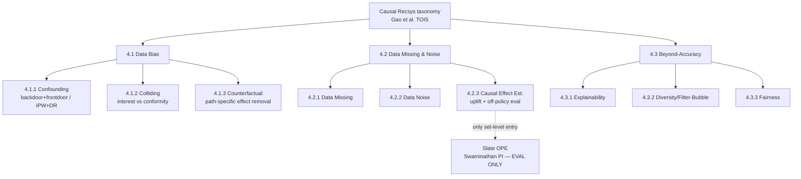

# Causal inference for ranking & bundle/set construction — landscape + ranked research lines

> **Run:** `causal-recsys-bundle-construction`, 2026-06-28. Deep multi-agent sweep (7 parallel
> researchers + cross-map), then a citation pass (every source URL fetched/verified) and an
> **adversarial review** whose FATAL/MAJOR findings are integrated below.
> **Citation verification + provenance:** [.provenance.md](causal-recsys-bundle-construction.provenance.md).
> Evidence labels: **FACT** = stated by a primary source we read; **GAP** = absence verified by
> exhaustive scan + spot-checks; **HYPOTHESIS** = our inference, to test empirically.

## TL;DR (the headline verdict)

1. **Both gap hypotheses are CONFIRMED**, triangulated across the field's own survey, both curated
   awesome-lists (~70 deduped papers), and targeted web search:
   - **GAP A — set/bundle-level causal *estimand for construction*:** white space. The field has
     set-level causal *evaluation* (slate off-policy estimators) and pointwise *confounder theory*
     (popularity/exposure backdoor), but has **never fused them into a set-construction decoder**.
   - **GAP B — causal *generative/diffusion* decoder:** essentially empty. Generative slate/bundle
     decoders (DiffRec, DreamRec, TIGER, GeMS, DDBC, DMSG) are non-causal; the few causal×generative
     works keep the causal term in the loss/representation/augmentation, not on the decode trajectory.
2. **The building blocks all exist and are non-inert** — PDA (inference-time popularity exponent),
   MACR (decode-time TIE subtraction), D3 (decode-score edit in generative recsys), UpliftRec
   (set-CATE on the decode path via DP), OPCB (set-propensity policy gradient). Only their
   **combination** (set-level estimand + co-occurrence/exposure confounding + generative/decode-path
   placement + intervention verification) is unoccupied.
3. **The bar is the hard part, not the gap.** Plain co-occurrence already beats DDBC full-catalog
   (DDBC's reported gains are within a ρ=100 *shortlist*, not full-catalog). The new method must beat
   **co-occ AND retrieve-then-rerank full-catalog** *and* show a verified causal gain.
4. **Two recent papers occupy our flanks — the deconfounding idea alone is no longer novel:**
   - **Cadence** (arXiv 2512.17733, Dec'25) already computes an *Unbiased Asymmetric Co-purchase
     Relationship* that **excludes popularity AND user attributes** from item-item co-purchase over a
     full deconfounded graph. So "deconfound co-occurrence vs popularity" is **prior art**. Our
     defensible novelty must be: estimand over the **constructed set / per-pick decode trajectory**
     (not a static reranked item graph), inside a **generative decoder**, and **intervention-verified**
     (a `do()`-flip test — which Cadence does not do). *A Cadence-UACR reranker is now a mandatory
     baseline.*
   - **A2G-DiffRec** (arXiv 2602.14706, SIGIR'26) does decode-path autoguidance on a set-level
     diffusion recommender — but with a **learned global** guidance weight (the "globally forced"
     pattern that displaced clean accuracy 3× in our sibling project), for item-side *fairness/long-tail*,
     not a causal estimand. Differentiator (fire only on **gated** cold/imbalanced slots) holds, and
     A2G is now evidence that global guidance is the wrong design.
5. **Recommended shortlist (3 designs → brainstorming):**
   **(S1) Observable-gated completion-deconfounding reranker** over the winning retrieve-then-rerank
   backbone — best realistic shot at the bar; **(S2) Set-PDA** — a load-bearing, observable-gated
   per-pick decode-path deconfounding term in a generative bundle decoder — highest novelty, higher
   risk; **(S3) within-set interaction (synergy) estimand** — the formal differentiator vs Cadence,
   to ride on S1 or S2. (Was a 2-design shortlist; the adversarial pass split it into a safe/ambitious
   pair plus the theoretical spine.)

---

## 1. The bar (recap — the filter every line is scored against)

From [docs/findings/00-SUMMARY.md](../../docs/findings/00-SUMMARY.md) and
[docs/learnings/LEARNINGS-from-bundle-ranking-project.md](../../docs/learnings/LEARNINGS-from-bundle-ranking-project.md):

- **FACT — full-catalog or it doesn't count.** Shortlist/sampled-neg eval over-claims (proven twice:
  content-reranker reversal; DDBC shortlist→full-catalog collapse to ~0.06 hit@1). DDBC's own eval is
  a **ρ=100 cosine-NN shortlist**, not full catalog.
- **FACT — co-occ already beats DDBC full-catalog.** "Beat DDBC" is cheap; the real bar is **beat
  co-occ AND retrieve-then-rerank** full-catalog. Retrieve-rerank (PPMI-SVD CF over co-occ
  candidates) wins on dense MealRec but **does not transfer** to the 254k-sparse Spotify catalog.
- **FACT — the inertness trap (3×).** Optional causal terms went inert every time. The predecessor's
  user-theme `do(seed)` moved the output ~2% vs a ~99% sampler-noise null; an oracle theme added ~0
  at the decode argmax.
- **FACT — "load-bearing ≠ better."** Forcing the causal term globally load-bearing displaced clean
  accuracy 3×. The working fix (gate-g) is **conditional/observable-gated** OR **decode-path /
  estimand-level** placement — never globally forced.
- **Mandatory diagnostic** on any causal term: ablation Δ, τ@0 / set-correlation under ablation,
  gradient-flow magnitude — plus (new, per adversarial review) **rank-inversion** vs raw co-occ AND
  PPMI (a monotone reweight can change scores while leaving the ranking identical = inert in effect).

Rubric: **novelty, fit-to-data** (use co-occ/exposure/popularity signal we KNOW exists, not
user-theme), **verifiability** (passes the inertness + rank-inversion battery), **feasibility** (vs
DDBC + co-occ/RR on our 3 datasets), **bar-clearing** (plausibly beats co-occ/RR full-catalog).

---

## 2. The field, as the survey draws it (Gao et al. 2208.12397, TOIS)

**FACT.** The canonical taxonomy is pointwise (treatment/outcome per user–item pair):

- **FACT.** "bundle", "basket", "complementary", "co-occurrence" appear **zero** times. Set-level
  causality appears **only** in §4.2.3 as off-policy *evaluation* of a slate policy (Swaminathan
  pseudoinverse; cascade/PBM-DR). "generative" = GAIL imitation; "diffusion" = GNN influence diffusion.
- **FACT.** The survey's most-developed confounders — item **popularity** (PDA, MACR), **exposure**
  (IPS/DR family), item-**category/exposure imbalance** (DecRS) — are exactly the confounders our data
  flagged. All pointwise; none at the set/co-occurrence level.
- **Four Future Directions:** 5.1 causal **discovery**, 5.2 causality-aware **stable/robust/OOD**
  (gate on observable shift), 5.3 causality-aware **GNN** ("open and uncharted frontier"), 5.4 causal
  **simulator/world-model** (the intervention-verification harness). None mentions set-level estimands
  or generative decoders → white space *in the field's own self-assessment*.

---

## 3. The decisive axis: WHERE the causal term lives (placement)

Placement determines inertness — the single most important filter for this project.

| Placement | Behavior at decode | Examples | Verdict |
|---|---|---|---|
| **loss-only** (propensity reweighting, DR objective, alignment regularizer) | scorer unchanged → **structurally inert** | IPS/Schnabel, DR-JL/MRDR/CDR, Saito-MNAR, CausE, ExpoMF, counterfactual-LTR, control-function | **AVOID** — predecessor's failure mode |
| **data-augmentation** | "counterfactual" consumed as training data → bypassable | CauseRec, CASR, CLBR, counterfactual-session-aug | **AVOID** (densification only) |
| **representation** | correction baked into embeddings; argmax can route around it | DecRS, CausalDiffRec, IV4Rec, COR | **CAUTION** — must ablate; user-theme was inert despite "being in the architecture" |
| **inference / decode-path** | term in the scoring/decode argmax → **exercised, ablatable** | **PDA**, **MACR**, **D3**, **UpliftRec** (DP), **OPCB** (set-policy gradient), **A2G-DiffRec** | **TARGET** — the only non-inert placements |

**FACT.** Of ~70 curated causal-recsys papers the decode-path set is tiny (PDA, MACR, CR, partly
DecRS/COR) and **all pointwise**. The set-level decode-path cell is empty except for very recent
non-construction work (UpliftRec category-ratios; A2G-DiffRec global-weight fairness; OPCB flat bandit).

**DDBC alignment (FACT, [docs/baselines/ddbc-repro-spec.md](../../docs/baselines/ddbc-repro-spec.md)):**
DDBC's **clamp/generate split** (observed seed tokens clamped, missing tokens iteratively unmasked) is
the natural structural carrier for a `do(item ∈ set)` intervention at decode. Its `cond_dim=128`
conditioning slot is **information-free today** (carries only a zeroed timestep embedding) — but
injecting there is **global FiLM conditioning (the inert pattern)**; a decode-path **per-pick logit**
correction is the non-inert placement. **Caveat (adversarial):** DDBC's decode is weak full-catalog
(its ρ=100 shortlist eval flatters it; co-occ beats it full-catalog), so any DDBC-backbone line risks
"beat DDBC but lose to co-occ".

---

## 4. Cross-map — each family at the SET/bundle level

For every family: treatment / outcome / confounder / estimand / non-inert placement / verifiability.
(Full per-paper tables in the provenance.)

### 4.1 Debiasing (IPW / DR / exposure / position / popularity / slate-OPE)
- **treatment** = joint exposure of candidate *j* given the partial bundle. **outcome** = held-out
  set-completion correctness. **confounder** = popularity / joint-exposure imbalance inflating raw
  co-occurrence. **estimand** = deconfounded complementarity `P(co-purchase | do(add j), exposure adj)`
  (DR/IPS-corrected; OPCB factored main+residual). **placement** = per-pick decode multiplier
  (PDA-style) or OPCB set-policy gradient, observable-gated.
- **verifiability** = PASSES *only if* the corrected score produces **rank inversions** (a scalar
  popularity reweight is monotone → can leave the ranking unchanged = inert). **RISK** = collapses to
  PPMI; importance weights clip to ~1 on sparse Spotify → inert. Must beat **PPMI-normalized** co-occ.

### 4.2 Deconfounding (backdoor / front-door / substitute-confounder / IV / causal embeddings)
- **treatment** = `do(add j | partial set)`. **confounder** = item-group/popularity distribution of
  the partial set (backdoor, DecRS-style) or unobserved seed/exposure confounders (front-door).
  **estimand** = backdoor `P(Y | do(add j), Σ popularity/group dist.)` or front-door with the
  **partial bundle as mediator** (HCR / Causal-Prompting factorization). **placement** = backdoor
  expectation pushed into per-pick scoring; or front-door computed over the partial-bundle
  continuations the decoder already materializes.
- **RISK** = backdoor absorbed into a representation washes out (ablate!); front-door inherits the
  **exponential-treatment positivity** problem (Complex-Treatments survey). **IV is an off-ramp** (no
  search-query instrument in our data).

### 4.3 Counterfactual + uplift (treatment = adding/recommending; estimand = CATE, not P(click))
- **treatment** = add item *j* to the partial bundle vs not. **outcome** = completion-lift.
  **confounder** = popularity/exposure (orthogonalized away, Neyman/Robinson). **estimand** =
  set-conditional CATE `lift(j|S) = E[Y|do(add j),S] − E[Y|S]`. **placement** = the decode **selection
  rule** itself (argmax lift, not argmax co-occ likelihood; UpliftRec's DP is the set-level precedent).
- **IDENTIFIABILITY RISK (FATAL as stated):** MealRec & Spotify-MPD have **no exposure logs**;
  Spotify-MPD has **no user ids**. A CATE on positives-only with no treatment-assignment data is
  **unidentifiable as stated**. Viable only if re-stated as an **observational complementarity contrast
  identified without propensities** (matched leave-one-out completion under an explicit
  *no-unobserved-confounding-given-the-partial-set* assumption, declared as a limitation).

### 4.4 Generative / diffusion causal decoder
- **treatment** = the decode trajectory (each unmask/denoise step under `do(item ∈ set | partial set)`;
  DDBC clamp/generate is the do-carrier). **outcome** = the completed SET. **confounder** =
  popularity/length amplification in the decoder's own logits (D3's amplification bias) + exposure-
  confounded co-occ baked into the generative likelihood. **estimand** = decode-time deconfounded
  generation score (set-level PDA×D3 per step, or front-door over partial-bundle mediators).
  **placement** = inference/decode path ONLY (D3 proves a frozen-model decode-score edit verifiably
  changes outputs). **RISK** = decoder may already implicitly normalize popularity (near-inert); weak
  DDBC backbone.

### 4.5 Set/slate/bundle-level combinatorial estimands
- **treatment** = the whole set as a combinatorial/permutation-invariant treatment `T ∈ {0,1}^m`.
  **estimand** = slate interventional value (Swaminathan PI) as a **construction** objective, or
  bundle-as-treatment effect; **within-set interaction (synergy)** = the named open problem
  (Complex-Treatments survey §8.1.2; NCoRE the lone structural precedent). **RISK** = the
  PI/SlateQ/PRR strand assumes **additive / single-choice reward** that erases synergy by construction;
  off-policy variance/positivity on 254k-sparse makes the value a near-no-op vs co-occ.

---

## 5. Novelty-collision watch (what is already taken)

| Paper | What it occupies | Threatens | Required differentiator |
|---|---|---|---|
| **Cadence** (2512.17733) | item-item co-purchase deconfounding excluding popularity **and** user-attrs, full-graph, full-catalog ablations | **PRIOR ART** for the deconfounding estimand of Set-PDA / joint-exposure / substitute-confounder | estimand over the **constructed set / per-pick decode**, inside a **generative decoder**, **`do()`-flip verified** (Cadence does none); + objective = completion/complementarity, not diversity. **Add Cadence-UACR reranker as a baseline.** |
| **A2G-DiffRec** (2602.14706) | decode-path autoguidance on a **set-level diffusion** recommender, **global learned weight**, item-side fairness/long-tail | the "decode-path guidance" mechanism of S1/S2 | ours = **observable-gated** (fire only on cold/imbalanced slots, gate-g), formal **causal estimand**, complementarity not long-tail; A2G's global weight is the anti-pattern we avoid |
| **UpliftRec** (2405.08582) | **set-CATE on the decode path** via DP, category-exposure ratios, needs CTR/propensities | completion-uplift line | per-item **add-to-partial-bundle** complementarity as a **selection rule** over retrieve-rerank, no category ratios, no propensities |
| **OPCB** (2408.11202) | **set propensity + off-policy learning**, factored main+residual | Bundle-OPCB | generative/iterative constructor with co-occ retriever as the regression baseline; (still needs logged propensities we lack) |
| **D3** (2406.14900) | decode-path score edit in generative recsys (non-inertness gold standard) | the *mechanism* of S2 | ours = formal `do()`/backdoor estimand, not a length/popularity normalization heuristic |
| **DMSG** (2408.06883) | diffusion **slate/bundle** decoder (joint set dist.), names playlists/bundles, **non-causal** | the generative substrate | add the causal estimand on the decode path |
| **Complex-Treatments survey** (2407.14022) + **NCoRE** (2103.11175) | bundle-as-treatment **effect estimation**; within-set interaction named OPEN | the synergy estimand's theory | instantiate for **recsys set construction**, full-catalog, decode-path |

---

## 6. Ranked research lines

Scores 1–5; **total** /25. Scores reflect the adversarial corrections (Cadence prior-art penalty on
deconfounding novelty; PPMI-collapse penalty on Set-PDA verifiability; DDBC-shortlist penalty on
generative-backbone bar; identifiability penalty on propensity-dependent lines).

| # | Line | Nov | Fit | Verif | Feas | Bar | Total | One-line + key risk |
|---|---|---|---|---|---|---|---|---|
| **1** | **Observable-gated completion-deconfounding reranker** — fire the causal term ONLY on cold/exposure-imbalanced slots, over the retrieve-rerank backbone | 4 | 4 | 4 | 4 | 4 | **20** | best realistic bar shot; falsifiable up front; risk = gated slice too small to move aggregate |
| **2** | **Set-PDA** — observable-gated popularity/exposure deconfounding as a per-pick decode multiplier in a generative bundle decoder | 4 | 5 | 4 | 4 | 3 | **20** | fills both gaps; risk = monotone→PPMI collapse + weak DDBC decode |
| **3** | **Completion-uplift reranker** — select by `do(add j)` completion-lift over retrieve-rerank | 5 | 4 | 3 | 3 | 4 | **19** | changes the estimand; **identifiability** without exposure logs is the crux |
| **4** | **Synergy-as-interaction decode term** — within-set interaction residual (NCoRE-style) on per-step logits | 5 | 4 | 3 | 2 | 3 | **17** | the formal differentiator vs Cadence; risk = synergy ≈ additive after deconfounding |
| **5** | **Joint-exposure pair-level deconfounder** — control-function/IV residualize co-occ by P(i,j jointly exposed) | 3 | 5 | 3 | 3 | 3 | **17** | Cadence prior-art + no valid instrument in MealRec/MPD → cosmetic PPMI relabel risk |
| **6** | **Bundle-OPCB** — set construction as off-policy learning (factored main+residual = RR + deconfound weight) | 4 | 4 | 4 | 2 | 3 | **17** | needs logged set-propensities we lack; clips to ~1 on sparse Spotify |
| **7** | **Front-door-over-partial-bundle** — partial bundle as mediator | 5 | 3 | 3 | 2 | 3 | **16** | proven implementable (Causal Prompting, HCR); positivity/variance; unidentifiable-as-stated |
| **8** | **Substitute-set-confounder** — factor-model co-occ matrix, residualize at decode (Wang-Blei lifted) | 3 | 4 | 3 | 3 | 2 | **15** | risk re-estimates popularity (= PPMI); Cadence prior-art |
| **9** | **Slate-OPE-as-objective** — pseudoinverse slate value drives the generative decoder | 4 | 3 | 3 | 2 | 2 | **14** | additive-per-slot kills synergy; needs propensities; unidentifiable-as-stated |
| **10** | **Causal message-passing over co-occ graph** (survey Future-Dir 5.3) | 5 | 3 | 2 | 2 | 2 | **14** | heavy GNN; edge term likely inert at readout (predecessor's exact failure) |
| — | ~~Counterfactual-sequence augmentation~~ (CauseRec/CASR) | 2 | 2 | 1 | 4 | 2 | **11** | **dead** — augmentation only, bypassable; keep as a densification trick |

> Lines #5/#6/#7/#9 are **unidentifiable-as-stated on our datasets** (no exposure logs / no user ids /
> no valid instrument) — kept for completeness, not shortlist candidates. See Open Questions.

---

## 7. Shortlist — 3 candidate method designs (→ brainstorming → writing-plans)

### S1 — Observable-gated completion-deconfounding reranker (safest path to the bar)
- **Treatment:** adding candidate *j* given the partial bundle. **Confounder:** popularity /
  joint-exposure. **Estimand (identifiable-without-propensities):** an observational complementarity
  contrast — deconfounded completion affinity of *j* given the partial set, identified by matched
  leave-one-out under a stated *no-unobserved-confounding-given-the-partial-set* assumption (NOT an
  IPS/CATE that needs exposure logs we lack).
- **Placement:** over the **winning retrieve-then-rerank backbone** (co-occ supplies candidates), the
  deconfounding term **fires only where an observable flags confounding** (cold-item / high
  exposure-imbalance / popularity-skew); clean, well-exposed slots keep the predictive RR score
  (gate-g). Tractable on 254k (no shortlist).
- **Inertness diagnostic:** ablate the gated term (revert to RR) for a full-catalog A/B; require
  **rank inversions** vs both raw co-occ and PPMI on the gated subpopulation (not just score deltas);
  gradient-flow where the gate fires; stratified gain on confounded vs clean slots.
- **Win condition (pre-registered):** beats raw co-occ AND retrieve-rerank AND a **Cadence-UACR
  reranker** full-catalog, with the gain **concentrated where the gate fires**.
- **Why:** rides the only backbone that already beats co-occ; encodes the two hardest lessons
  (observable gate + decode-active term). **Main risk:** gated slice too small to move aggregate
  metrics → must report the stratified gated-subpopulation metric, not only global recall.

### S2 — Set-PDA: decode-path deconfounding in a generative bundle decoder (highest novelty)
- **Treatment/estimand:** as S1, but realized as a **per-pick decode-time multiplier** on the
  generative decoder's unmask logit, `score(j) = deconfounded-match(j | partial set) ·
  propensity(j)^(−γ_obs)`, with **γ observable-conditioned per slot** (so the transform is
  **non-monotone across slots**, defeating the PPMI-collapse trap). Carried by DDBC's clamp/generate
  split (the do-carrier) — **per-pick logit, not the inert `cond_dim` FiLM slot**.
- **Inertness diagnostic:** γ=0 must exactly recover the baseline set; sweep γ and measure (a) τ@0 /
  set-correlation baseline-vs-corrected (must beat the ~99% sampler-noise null, unlike the predecessor's
  ~2%), (b) **rank inversions** vs raw co-occ AND PPMI, (c) gradient-flow of the propensity term into
  the chosen token, (d) full-catalog set-recall on the gated subpopulation.
- **Win condition:** beat co-occ, retrieve-rerank, **Cadence-UACR**, AND PPMI-normalized co-occ
  full-catalog (not the ρ=100 shortlist).
- **Why:** fills **both** gaps (set-level estimand + causal generative decoder) and is `do()`-flip
  verified (which Cadence is not). **Main risks (adversarial):** inherits DDBC's weak full-catalog
  decode → may beat DDBC but lose to co-occ (gate the bar on full-catalog, not shortlist); scalar
  reweight risks PPMI collapse (mitigated by per-slot γ + rank-inversion test).

### S3 — Within-set interaction (synergy) estimand — the theoretical spine / Cadence differentiator
- **Estimand:** the causal value of adding *j* to partial set *S* as a potential-outcomes
  **interaction** effect: `τ_synergy(j|S) = deconfounded-co-consumption(S+j) − Σ deconfounded pairwise
  effects` (the NCoRE-style non-additive residual). This is the one thing **neither Cadence (additive
  item-item) nor PI/SlateQ (additive-by-assumption)** captures, and the Complex-Treatments survey names
  it OPEN.
- **Placement:** rides S1 (as the reranker score) or S2 (per-step logit). **Falsify first (cheap CPU
  screen):** measure the non-additive synergy residual magnitude **after** popularity deconfounding on
  a held-out slice **before** any GPU/decode integration. If the residual ≈ 0, synergy collapses to
  additive and the line is dropped — this is the make-or-break pre-test.
- **Why:** the cleanest defensible novelty post-Cadence. **Main risk:** the residual may be near-zero
  (hence the up-front falsification gate).

### Shared spine
Frame the estimand as **within-set completion / interaction**, NOT anti-popularity diversity (Cadence)
or item-side long-tail fairness (A2G-DiffRec). Pre-screen datasets with the exposure-imbalance /
spectral-energy diagnostic (payoff-gated tiering) before GPU spend.

---

## 8. Open questions & risks (carry to brainstorming)

- **Does deconfounded co-occ beat PPMI *and* Cadence-UACR?** If deconfounding collapses to popularity
  normalization, there is no new signal (PPMI-SVD already does some of this and failed on sparse
  Spotify; Cadence already deconfounds item-item co-purchase). The popularity-trivial random-negatives
  check + a Cadence-UACR baseline must adjudicate.
- **Identifiability without instruments/propensities.** MealRec and Spotify-MPD lack exposure logs;
  Spotify-MPD has no user ids. Lines #3/#5/#6/#7/#9 need propensities/instruments/mediators those
  datasets do not supply → re-state as observational contrasts with declared assumptions, or drop.
- **Sparse-catalog wall.** Every propensity/CF route degraded on 254k Spotify. Pre-screen with an
  exposure-imbalance / spectral-energy diagnostic before committing GPU.
- **Synergy may be additive.** If within-set interaction ≈ 0 after popularity deconfounding, the
  novelty differentiator vs Cadence evaporates — S3's falsification gate runs first.
- **DDBC-backbone risk.** Generative-decode lines inherit a backbone that loses to co-occ full-catalog
  (its win is shortlist-only); prefer reranker placement (S1) unless the generative decode is
  independently fixed.
- **Verification standard.** No surveyed causal-recsys method runs a `do()`-flip / τ@0 inertness test
  at the construction argmax — this is both our methodological contribution and the bar every line is
  held to.

---

## 9. References

Full cited list with per-URL verification status in
[.provenance.md](causal-recsys-bundle-construction.provenance.md). Anchors (all verified resolving):
Gao et al. survey ([2208.12397](https://arxiv.org/abs/2208.12397)); PDA
([2105.06067](https://arxiv.org/abs/2105.06067)); MACR ([2010.15363](https://arxiv.org/abs/2010.15363));
DecRS ([2105.10648](https://arxiv.org/abs/2105.10648)); HCR
([2205.07499](https://arxiv.org/abs/2205.07499)); DCCF ([2110.07122](https://arxiv.org/abs/2110.07122));
Deconfounded Recommender (Wang/Blei,
[PDF](http://www.cs.columbia.edu/~blei/papers/WangLiangCharlinBlei2020.pdf)); Swaminathan slate PI
([1605.04812](https://arxiv.org/abs/1605.04812)); AIPS
([2306.15098](https://arxiv.org/abs/2306.15098)); OPCB
([2408.11202](https://arxiv.org/abs/2408.11202)); UpliftRec
([2405.08582](https://arxiv.org/abs/2405.08582)); DLCE
([2008.04563](https://arxiv.org/abs/2008.04563)); D3
([2406.14900](https://arxiv.org/abs/2406.14900)); Causal Prompting
([2403.02738](https://arxiv.org/abs/2403.02738)); DiffRec
([2304.04971](https://arxiv.org/abs/2304.04971)); DreamRec
([2310.20453](https://arxiv.org/abs/2310.20453)); CausalDiffRec
([2408.00490](https://arxiv.org/abs/2408.00490)); DifFaiRec
([2410.02791](https://arxiv.org/abs/2410.02791)); A2G-DiffRec
([2602.14706](https://arxiv.org/abs/2602.14706)); DMSG
([2408.06883](https://arxiv.org/abs/2408.06883)); Cadence
([2512.17733](https://arxiv.org/abs/2512.17733)); Complex-Treatments survey
([2407.14022](https://arxiv.org/abs/2407.14022)); NCoRE
([2103.11175](https://arxiv.org/abs/2103.11175)); Su et al. orthogonal uplift
([2602.19851](https://arxiv.org/abs/2602.19851)); COR
([DOI 10.1145/3485447.3512251](https://dl.acm.org/doi/10.1145/3485447.3512251)); DDBC
([OpenReview dKyhgfe50H](https://openreview.net/forum?id=dKyhgfe50H)).
